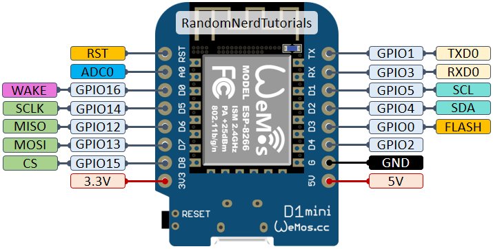

# esp_current_measurement
1. Connect esp8266 and INA-291 as (5V-VCC), (G-GND), (D1,SCL), (D2,SDA)
2. For Arduino Uno (A4, SDA), (A5,SCL)
3. Do not use "DFRobot_INA219.h"
4. use <Adafruit_INA219.h>
5. WeMos D1 mini Pinout 
